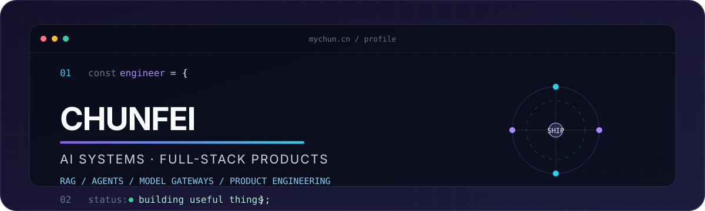

<div align="center">
  
</div>

<br />

<div align="center">
  <a href="https://github.com/Chun556699?tab=repositories"></a>
  <a href="mailto:chun556699@gmail.com"></a>
</div>

## Hello, I'm Chunfei 👋

I build **AI systems that become usable products** — from retrieval, agents and model gateways to polished full-stack experiences.

我是一名专注于 **AI 应用工程与全栈产品化** 的软件工程师。比起只做一个 Demo，我更在意完整链路：架构、可靠性、交互、部署，以及产品是否真正可用。

```text
CURRENT FOCUS
├─ AI Engineering      RAG · Agents · Memory · Knowledge Graphs
├─ Platform Systems    Model Gateway · Routing · Observability
└─ Product Craft       TypeScript · React · Next.js · FastAPI
```

## Selected builds

<table>
  <tr>
    <td width="50%" valign="top">
      <h3>🧩 <a href="https://github.com/Chun556699/RAG-KnowledgeBase">RAG KnowledgeBase</a></h3>
      <p>Production-oriented AI knowledge platform with hybrid retrieval, reranking, CRAG, ReAct agents, long-term memory, GraphRAG and quality evaluation.</p>
      <p><code>FastAPI</code> <code>React</code> <code>TypeScript</code> <code>RAG</code> <code>Docker</code></p>
    </td>
    <td width="50%" valign="top">
      <h3>🌐 <a href="https://github.com/Chun556699/ai-Integration">AI Gateway</a></h3>
      <p>OpenAI-compatible multi-provider gateway featuring weighted routing, failover, token billing, API key management and operational monitoring.</p>
      <p><code>Python</code> <code>FastAPI</code> <code>SQLite</code> <code>LLM Gateway</code></p>
    </td>
  </tr>
  <tr>
    <td width="50%" valign="top">
      <h3>🌍 <a href="https://github.com/Chun556699/Transformer-parallel-translation">Transformer Translation</a></h3>
      <p>An efficient neural machine translation system exploring data purification, adaptive curriculum learning and model compression.</p>
      <p><code>PyTorch</code> <code>Transformer</code> <code>NLP</code> <code>CUDA</code></p>
    </td>
    <td width="50%" valign="top">
      <h3>📄 <a href="https://github.com/Chun556699/resume-builder">AI Resume Builder</a></h3>
      <p>A privacy-friendly resume studio with live editing, eight layouts, PDF/PNG export, OCR import and AI-assisted writing.</p>
      <p><code>Next.js</code> <code>React</code> <code>TypeScript</code> <code>Zustand</code></p>
    </td>
  </tr>
</table>

## Engineering toolkit

<div align="center">
  
</div>

<br />

| Area | What I work with |
| --- | --- |
| **AI systems** | RAG pipelines, hybrid search, reranking, agents, memory, GraphRAG, prompt engineering |
| **Backend** | Python, FastAPI, async services, OpenAI-compatible APIs, SQLite, system architecture |
| **Frontend** | TypeScript, React, Next.js, Vite, Tailwind CSS, product UI and data visualization |
| **Delivery** | Docker, Nginx, GitHub Actions, Linux, testing, documentation and observability |

## GitHub signal

<div align="center">
  <picture>
    <source media="(prefers-color-scheme: dark)" srcset="https://github-readme-stats.vercel.app/api?username=Chun556699&show_icons=true&hide_border=true&bg_color=0D1117&title_color=A78BFA&icon_color=22D3EE&text_color=C9D1D9&rank_icon=github" />
    <source media="(prefers-color-scheme: light)" srcset="https://github-readme-stats.vercel.app/api?username=Chun556699&show_icons=true&hide_border=true&bg_color=FFFFFF&title_color=6D28D9&icon_color=0891B2&text_color=1F2937&rank_icon=github" />
    
  </picture>
  <picture>
    <source media="(prefers-color-scheme: dark)" srcset="https://github-readme-stats.vercel.app/api/top-langs/?username=Chun556699&layout=compact&hide_border=true&bg_color=0D1117&title_color=A78BFA&text_color=C9D1D9" />
    <source media="(prefers-color-scheme: light)" srcset="https://github-readme-stats.vercel.app/api/top-langs/?username=Chun556699&layout=compact&hide_border=true&bg_color=FFFFFF&title_color=6D28D9&text_color=1F2937" />
    
  </picture>
</div>

<br />

<div align="center">
  <sub>Build the system. Polish the experience. Ship the product.</sub>
  <br />
  <sub>把复杂系统做清楚，把技术能力变成真正可用的产品。</sub>
</div>

